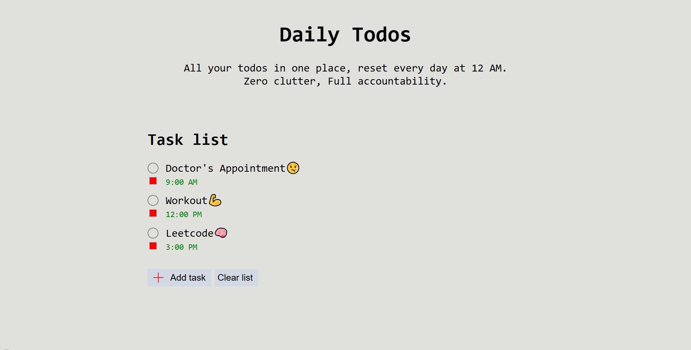

# Daily Todo App

A minimal daily todo web app built with HTML, CSS, and vanilla JavaScript.

## Features
- Task creation
- Task completion
- Time-based sorting
- LocalStorage persistence
- Daily task reset

## About
The aim of this project was to learn dynamic webpage programming fundamentals.
It may be revisited in the future.
